# Vystra — AI-Powered Video Search & Insights

[](https://www.docker.com/)
[](#)
[](#)
[](#)
[](#)

Vystra converts uploaded video content into searchable, vector-indexed segments. By leveraging AI-driven transcription, semantic vector search, and structured insights, Vystra enables users to discover specific moments and actionable summaries across their video library.

---

## Table of Contents

- [Overview](#overview)
- [System architecture](#system-architecture)
  - [Production flow (high-level)](#production-flow-high-level)
  - [Local development flow](#local-development-flow)
- [Key features](#key-features)
- [Tech stack](#tech-stack)
- [Quickstart (local)](#quickstart-local)
  - [Prerequisites](#prerequisites)
  - [Clone & configure](#clone--configure)
  - [Environment (.env) example](#environment-env-example)
  - [Start services](#start-services)
  - [Run frontend](#run-frontend)
  - [Test upload (curl example)](#test-upload-curl-example)
- [Stripe integration (billing)](#stripe-integration-billing)
- [Deployment checklist (production)](#deployment-checklist-production)
- [Contributing](#contributing)
- [License](#license)
- [References & code pointers](#references--code-pointers)

---

## Overview

Vystra is a scalable AI integrated Saas platform that ingests videos, extracts and transcribes audio, generates embeddings, stores vectors in Postgres (pgvector + HNSW), produces structured insights (JSON), and exposes semantic search through a FastAPI backend and a Next.js frontend.

---

## System architecture

### Production flow (high-level)

The production environment uses managed services for scalability and reliability: Cloudflare R2 (object storage), RabbitMQ (broker), Upstash Redis (results cache), and a managed Postgres with pgvector (Neon or equivalent).

<p align="center">
  
</p>

### Local development flow

Local development uses `docker-compose` with MinIO, Redis, and a `pgvector`-enabled Postgres image to reproduce the full pipeline.

<p align="center">
  
</p>

---
## End-to-End Workflow
1.  **Handshake:** User selects a video. Frontend requests a secure **Presigned URL** from FastAPI.
2.  **Direct Upload:** Frontend uploads the file directly to object storage (MinIO/R2), bypassing the backend server to reduce load and latency.
3.  **Queueing:** Once the upload is confirmed, Frontend notifies the API, which enqueues a processing task in RabbitMQ/Redis.
4.  **Processing:** A Celery Worker fetches the raw file, extracts audio via `ffmpeg`, and sends audio chunks for transcription.
5.  **Indexing:** Transcripts are segmented and embedded into `Vector(384)`. These vectors are stored in Postgres (`pgvector`).
6.  **Insight:** An LLM generates a structured summary, saved to the database.
7.  **Search:** Users query the system; the backend performs an HNSW vector search to find the most relevant video segments instantly.
8.  **Streaming:** Real-time transcription and insights are streamed back to the frontend for immediate feedback.
---
## Key features

* **Direct-to-Cloud Uploads:** Frontend uploads directly to S3/R2 using presigned URLs, eliminating backend bottlenecks and ensuring unlimited file size scalability.
* **Audio Intelligence:** Static `ffmpeg` builds included in workers for robust audio extraction and chunking.
* **AI Transcription & Insights:** Utilizes Whisper-class models for text and LLMs for structured JSON summaries.
* **Semantic Search:** Implements `pgvector` with HNSW indexing for millisecond-latency Approximate Nearest Neighbor (ANN) search.
* **Scalable Pipeline:** Decoupled architecture using Celery and RabbitMQ (Production) or Redis (Local).
* **Hybrid Storage:** S3-compatible support (MinIO for local, Cloudflare R2 for production).
* **Billing Ready:** Native Stripe integration for subscription and metered usage billing.

---

## Tech stack

- Frontend: `Next.js` (React)
- Backend: `FastAPI` (Uvicorn)
- Workers: `Celery` (Python)
- Broker: `Redis` (local) / `RabbitMQ` (production)
- Result cache: `Redis` / `Upstash Redis`
- Database: `Postgres` + `pgvector` (HNSW)
- Object storage: `MinIO` (local) / `Cloudflare R2` (prod)
- AI providers: `Groq` (Whisper & Llama) and `FastEmbed`
- Orchestration: `Docker Compose` (local); containers on Render / Heroku / K8s (prod)

---

## Quickstart (local)

### Prerequisites

- Docker & Docker Compose
- Node.js 18+ (for frontend)
- Optional: `GROQ_API_KEY` for live transcription/LLM calls

### Clone & configure

```bash
git clone https://github.com/YOUR_USERNAME/vystra.git
cd vystra
cp .env.example .env
```

### Environment (.env) example

Create `.env` in the repository root and populate values similar to the example below:

```env
# Database & Redis
DATABASE_URL=postgresql://local_user:local_password@db:5432/vystra_dev
REDIS_URL=redis://redis:6379/0

# Object Storage (MinIO)
AWS_ACCESS_KEY_ID=minioadmin
AWS_SECRET_ACCESS_KEY=minioadmin
AWS_ENDPOINT_URL=http://minio:9000
AWS_BUCKET_NAME=vystra-videos

# AI Provider
GROQ_API_KEY=your_groq_api_key_here

# Worker tuning
OMP_NUM_THREADS=1
MKL_NUM_THREADS=1
```

> Keep secrets out of source control. Use your cloud provider's secret manager in production.

### Start services

```bash
docker-compose up --build
```

### Run frontend (local)

```bash
cd frontend
npm install
npm run dev
# Open http://localhost:3000
```

### Test upload (curl example)

```bash
curl -X POST "http://localhost:8000/api/v1/upload" \
  -H "accept: application/json" \
  -H "Content-Type: multipart/form-data" \
  -F "file=@demo_video.mp4;type=video/mp4"
```

---

## Stripe integration (billing)

Vystra supports subscription and metered billing. The worker records processed seconds and the backend can report usage to Stripe for metered plans.

Minimal FastAPI webhook handler:

```python
from fastapi import FastAPI, Request, Header, HTTPException
import stripe

app = FastAPI()
stripe.api_key = STRIPE_SECRET_KEY

@app.post("/webhook")
async def stripe_webhook(request: Request, stripe_signature: str = Header(None)):
    payload = await request.body()
    try:
        event = stripe.Webhook.construct_event(payload, stripe_signature, STRIPE_WEBHOOK_SECRET)
    except Exception as e:
        raise HTTPException(status_code=400, detail=str(e))

    if event["type"] == "checkout.session.completed":
        # Provision user access / store customer mapping
        pass

    return {"status": "ok"}
```

---

## Deployment checklist (production)

- Database
  - [✅] Provision managed Postgres (Neon or similar) and enable `pgvector`.
  - [✅] Run DB migrations (including `CREATE EXTENSION IF NOT EXISTS vector;`).
- Storage & broker
  - [✅] Create Cloudflare R2 bucket and configure CORS / lifecycle policies.
  - [✅] Provision RabbitMQ (CloudAMQP) and set `CELERY_BROKER_URL`.
  - [✅] Provision Upstash Redis (or managed Redis) for result caching.
- Workers & images
  - [✅] Build and publish the worker image (include static `ffmpeg`).
  - [✅] Ensure the worker image targets the required platform (e.g., `linux/amd64`).
- Security & secrets
  - [✅] Store GROQ, STRIPE, and other secrets in the cloud provider secret manager.
  - [✅] Use `rediss://` for Upstash / Redis TLS endpoints.
- Observability
  - [ ] Implement logging and tracing for backend and workers.

---

## Contributing

- Fork the repository and create a feature branch: `git checkout -b feature/your-feature`
- Commit and push changes, then open a PR into `develop`.
- If you change the embedding model, update the Postgres vector column dimension and reindex.

---

## License

Distributed under the MIT License. See `LICENSE` for details.

---

## References & code pointers

Inspect these modules for implementation details:

- `worker/app/helpers/video_processing.py` — audio extraction, transcription, embeddings, insights
- `worker/app/core/model_loader.py` — FastEmbed and Groq client initialization
- `backend/app/database/models.py` — `Video` and `VideoSegment` models (Vector column)
- `backend/app/services/semantic_search.py` — query embedding and ANN search

---
